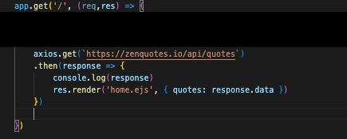
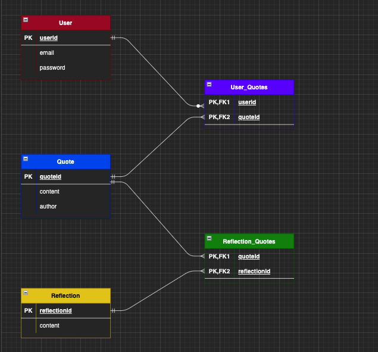
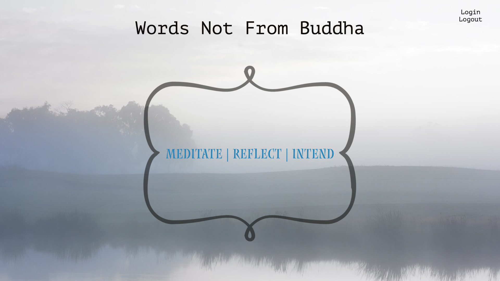
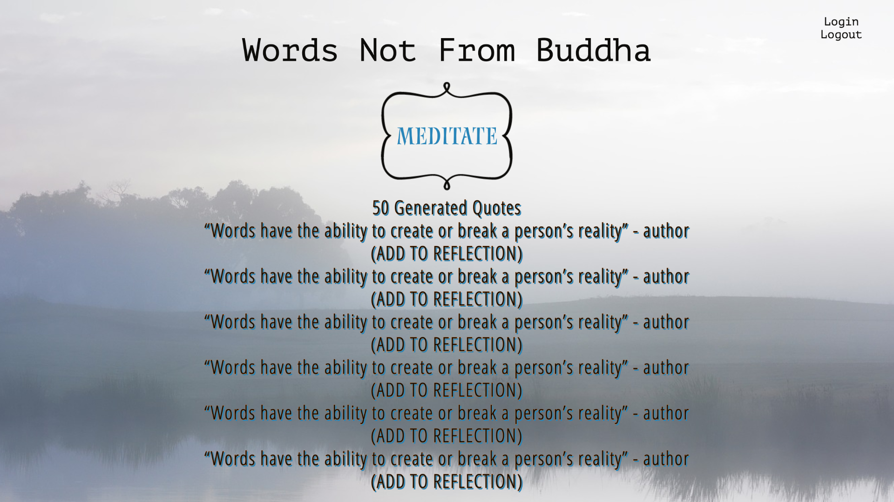
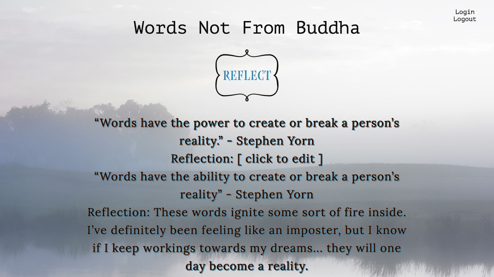
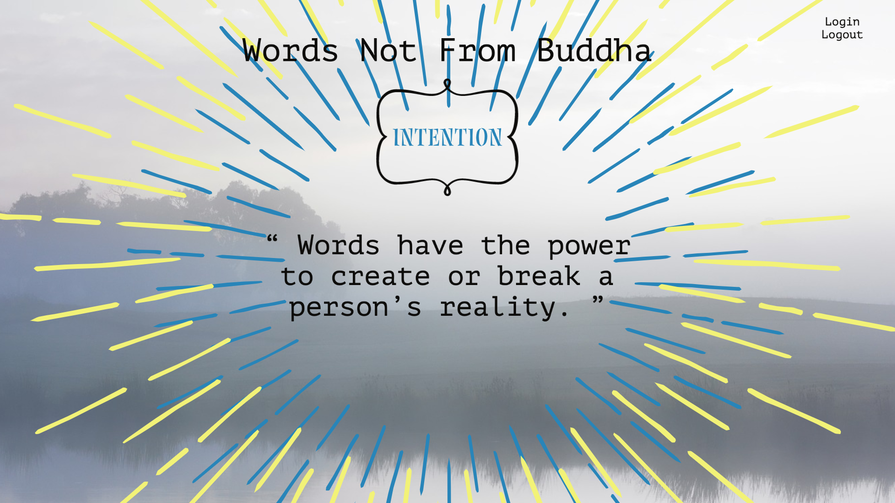

# Words Not From Buddha

## Project Idea and Description

Words have the power to create or break a person's reality. 
Words Not From Buddha is inspired by moments of clarity that I've experienced through reading meaningful words strung together. This online application will generate random quotes from ZenQuotes API (often related to inspiration, motivation, or life truths) in order to stimulate the user's ability to meditate, reflect or create intentions. 
My goal is to create a virtual space for users to just "Zen Out".

* Meditation - Users will scroll through a list of random generated quotes and add it to their account.
* Reflection - Users can add reflections to their saved quotes.
* Intention - Users will display a single quote through a virtual vision board and "manifest it".

## API

https://zenquotes.io/

## ERD's

## Restful Routing Charts

#### User

| Method | Action | Description |
|:------:|:------:|:-----------:|
| POST   | /users | Create new user |
| GET    | /users/new | Render form for creating new User |
| PUT    | /users/:id | Edit User |
| DELETE | /users/:id | Delete User |

#### Meditate
| Method | Action | Description |
|:------:|:------:|:-----------:|
| GET    | /users/:id/meditate | Show 50 random quotes |
| POST   | /users/:id/meditate | Add quotes to user's reflect page |

#### Reflect
| Method | Action | Description |
|:------:|:------:|:-----------:|
| GET    | /users/:id/reflect | Show all quotes with reflections |
| GET    | /users/:id/reflect/:id/new | Render form to create a reflection for a quote |
| POST   | /users/:id/reflect/:id/new | Create a reflection for a quote |
| GET    | /users/:id/reflect/:id | Show a single quote with reflection |
| DELETE | /users/:id/reflect | Delete quote from reflection page |
| GET    | /users/:id/reflect/:id/edit | Show form to edit reflection |
| PUT    | /users/:id/reflect/:id/edit | Edit reflection |
| DELETE | /users/:id/reflect/:id | Delete reflection |

#### Intention
| GET    | /users/:id/intention/:id | Display a single quote with no reflection|

## Techstack

* Node
* Axios
* Postgresql
* Sequelize
* Express
* Javascript
* CSS
* HTML
* Bcrypt
* Cookie-Parser
* Crypto-JS
* Dotenv
* EJS
* Express-ejs-layouts

## Wireframes

## User Stories

* As a user, I want to create an account, login and logout.
* As a user, I want to view quotes and add it to my account.
* As a user, I want to view the quotes I saved and add reflections.
* As a user, I want to view a single quote and display it on a virtual vision board.

## MVP
* A display for all quotes (meditate)
* A display for all saved quotes (reflect)
* A display for a single quote (intention)
* Functioning routes
* Functioning forms to create, delete, or update reflections per quote.
* Functioning forms to delete or add quotes to reflect page.

## Stretchgoals
* Audios for each specific page.