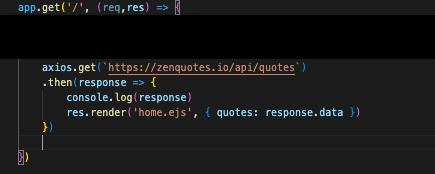
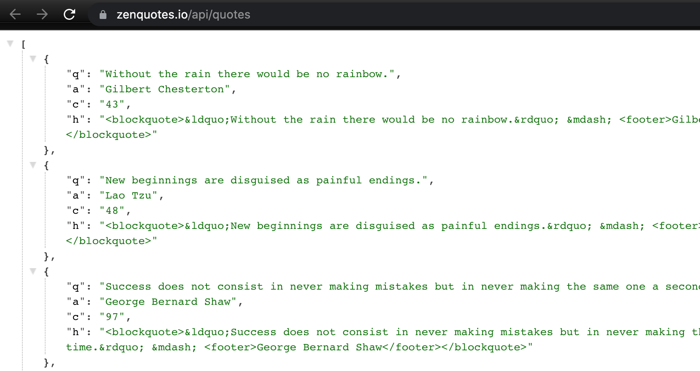
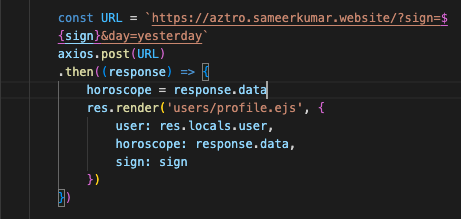
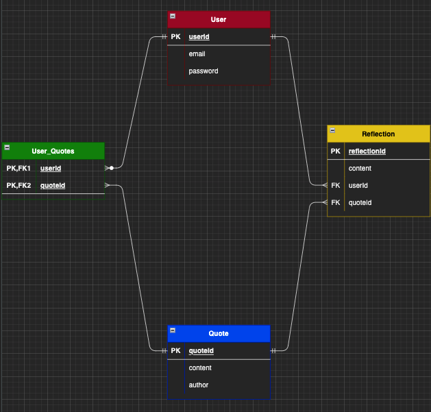
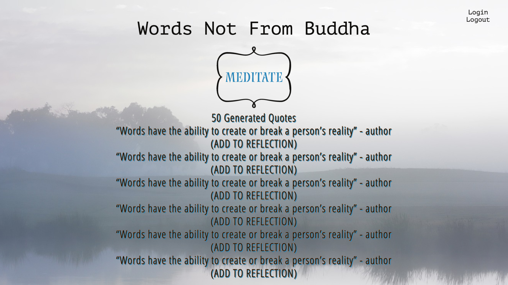
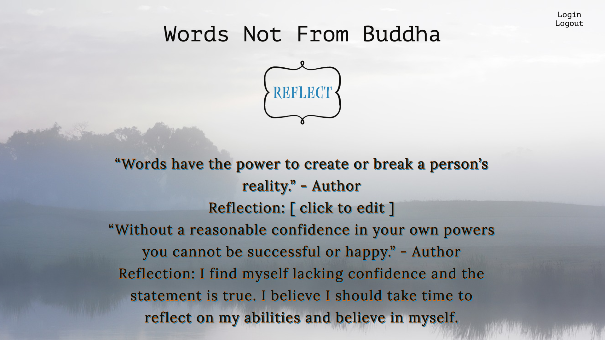
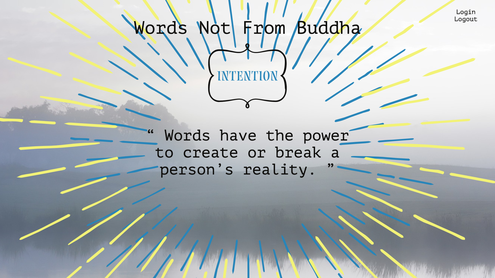

# Words Not From Buddha

## Project Idea and Description

Words have the power to create or break a person's reality. 
Words Not From Buddha is inspired by moments of clarity that I've experienced through reading meaningful words strung together. This online application will generate random quotes from ZenQuotes API (often related to inspiration, motivation, or life truths) in order to stimulate the user's ability to meditate, reflect or create intentions. Users that sign up will also receive a FREE daily horoscope through Aztro API.

My goal is to create a virtual space for users to just "Zen Out".

Special thanks to my dear friend, Sean Agcaoili.

This web application is a tribute to our friendship and the moments where we would light incense, meditate and reflect on our lives.

* Meditate - Users will scroll through a list of random generated quotes and add it to their account.
* Reflect - Users can add reflections to their saved quotes.
* Intention - Users will display a single quote through a virtual vision board and "manifest it" into their lives.

## API

https://zenquotes.io/

https://aztro.readthedocs.io/en/latest/#

## ERD's

## Restful Routing Charts

#### User

| Method | Action | Description |
|:------:|:------:|:-----------:|
| POST   | /users | Create new user |
| GET    | /users/new | Render form for creating new User |
| PUT    | /users/profile | Edit User |
| DELETE | /users/profile | Delete User |

#### Meditate
| Method | Action | Description |
|:------:|:------:|:-----------:|
| GET    | /users/:id/meditate | Show 50 random quotes |
| POST   | /users/:id/meditate | Add quotes to user's reflect page |

#### Reflect
| Method | Action | Description |
|:------:|:------:|:-----------:|
| GET    | /users/:id/reflect | Show all quotes with reflections |
| GET    | /users/:id/reflect/:id | Render form to create a reflection for a quote |
| POST   | /users/:id/reflect/:id | Create a reflection for a quote |
| GET    | /users/:id/reflect/:id | Show a single quote with reflection(s) |
| DELETE | /users/:id/reflect | Delete quote from reflection page |
| GET    | /users/:id/reflect/edit/:id | Show form to edit reflection |
| PUT    | /users/:id/reflect/edit/:id | Edit reflection |

#### Intention
| Method | Action | Description |
|:------:|:------:|:-----------:|
| GET    | /users/:id/intention/ | Display list of saved quotes with no reflection
| GET    | /users/:id/intention/:id | Display a single quote with no reflection|

## Techstack

* Javascript
* CSS
* HTML
* Node
* Axios
* Postgresql
* Sequelize
* Express
* Bcrypt
* Cookie-Parser
* Crypto-JS
* Dotenv
* EJS
* Express-EJS-Layouts
* Method-Override

## Wireframes

## User Stories

* As a user, I want to create an account, login and logout.
* As a user, I want to view quotes and add it to my account.
* As a user, I want to view and delete the quotes I saved.
* As a user, I want to create, edit and delete reflections for each quote.
* As a user, I want to view a single quote and display it on a virtual vision board.

## MVP
* A display for all quotes (meditate)
* A display for all saved quotes (reflect)
* A display for a single quote (intention)
* Functioning routes
* Functioning forms to create, delete, or update reflections per quote.
* Functioning forms to delete or add quotes to reflect page.

## Stretchgoals
* Add and display username
* Allow uses to edit their profile (username, email, password, birthday)
* Add second API (horoscopes)
* Add a toggle button to change website theme

## Potential Roadblocks
* Associating mutliple models
* CSS
