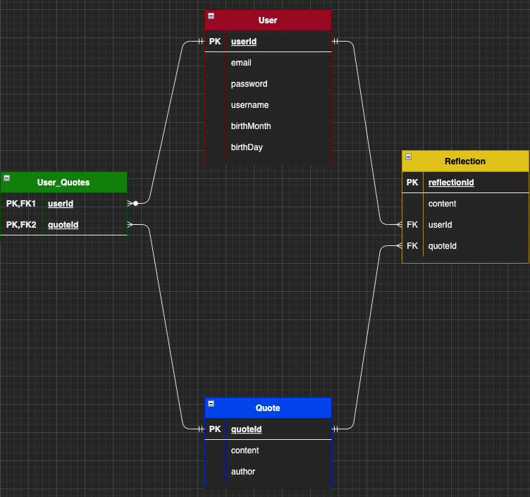

# Words Not From Buddha

## Link to Web Application

https://wordsnotfrombuddha-syorn96.koyeb.app/

## Project Idea and Description

Words have the power to create or break a person's reality. 
Words Not From Buddha is inspired by moments of clarity that I've experienced through reading meaningful words strung together. This online application will generate random quotes from ZenQuotes API (often related to inspiration, motivation, or life truths) in order to stimulate the user's ability to meditate, reflect or create intentions. Users that sign up will also receive a FREE daily horoscope through Aztro API.

My goal is to create a virtual space for users to just "Zen Out".

Special thanks to my dear friend, Sean Agcaoili.
This web application is a tribute to our friendship and the moments where we would light incense, meditate and reflect on our lives.

WNFB will allow users to:
* Meditate - Users will scroll through a list of random generated quotes and add it to their account.
* Reflect - Users will add reflections to their saved quotes.
* Intention - Users will display a single quote through a virtual vision board and "manifest it" into their lives.

## Live Installation

1. Fork or clone down this repo
2. Open repo terminal and run ```touch .gitignore echo >> node_modules ```
3. Run ```touch .env ```
4. In .env create a variable ENC_KEY 
5. EXAMPLE: ```ENC_SECRET=< your secret code >```
6. Run ``` npm init ```
7. Install dependencies. 
8. Run ``` npm install nodemon axios postgresql sequelize ExpressBcrypt Cookie-Parser Crypto-JS Dotenv EJS Express-EJS-Layouts Method-Override ```
9. Run ```createdb words-not-from-buddha```
10. Run ```sequelize db:create```
11. Run ```sequelize db:migrate```
12. Run ```nodemon``` in the terminal
13. Open http://localhost:3000/ in your browser.
14. Create a new account to access the application and your FREE horoscope!
15. Have fun "Zenning-Out!"


## API

https://zenquotes.io/


https://aztro.readthedocs.io/en/latest/#


## ERD's



## Restful Routing Charts

#### Users

| Method | URL pattern | Action | Description |
|:------:|:-----------:|:------:|:-----------:|
| POST   | /users | Create | Create new user |
| GET    | /users/login | Read | Render form for users to log in |
| POST   | /users/login | Read | Verify user login info |
| GET    | /users/logout | Read | Log out user & user cookie id |
| GET    | /users/new | Read | Render form for creating new User |
| GET    | /users/profile | Read | Display User information & FREE horoscope |
| GET    | /users/profile/account | Read | Render form for updating user information |
| PUT    | /users/profile/account | Update | Edit/update User information |
| DELETE | /users/profile/account | Delete | Delete User from DB |

#### Meditate
| Method | URL pattern | Action | Description |
|:------:|:------:|:------:|:-----------:|
| GET    | /users/:id/meditate | Read | Show 50 random quotes |
| POST   | /users/:id/meditate | Create | Add quote(s) to user's reflect page |

#### Reflect
| Method | URL pattern | Action | Description |
|:------:|:-----------:|:------:|:-----------:|
| GET    | /users/reflect/ | Read | Show all quotes with reflections |
| GET    | /users/reflect/:id | Read | Render form to create a reflection for a quote |
| POST   | /users/reflect/:id | Create | Create a reflection for a quote |
| GET    | /users/reflect/:id | Read | Show a single quote with reflection(s) |
| DELETE | /users/reflect/:id | Destroy | Delete quote from reflection page |
| GET    | /users/reflect/edit/:id | Read | Show form to edit reflection |
| PUT    | /users/reflect/edit/:id | Update | Edit reflection |
| DELETE | /users/reflect/edit/:id | Destroy | Delete single reflection from a quote |

#### Intention
| Method | URL pattern | Action | Description |
|:------:|:-----------:|:------:|:-----------:|
| GET    | /users/:id/intention/ | Read | Display list of saved quotes with no reflection |
| GET    | /users/:id/intention/:id | Read | Display a single quote with no reflection |

## Techstack

* Javascript
* CSS
* HTML
* Node
* Axios
* Postgresql
* Sequelize
* Express
* Bcrypt
* Cookie-Parser
* Crypto-JS
* Dotenv
* EJS
* Express-EJS-Layouts
* Method-Override


## Wireframes


## User Stories

* As a user, I want to create an account, login and logout.
* As a user, I want to view quotes and add it to my account.
* As a user, I want to view and delete the quotes I saved.
* As a user, I want to create, edit and delete reflections for each quote.
* As a user, I want to view a single quote and display it on a virtual vision board.

## MVP
* A display for all quotes (meditate)
* A display for all saved quotes (reflect)
* A display for a single quote (intention)
* Functioning routes
* Functioning forms to create, delete, or update reflections per quote.
* Functioning forms to delete or add quotes to reflect page.

## Stretchgoals
* Add second API (horoscopes)
* Add and display username + horoscope
* Allow users to edit their profile (username, email, password, birthday)
* Add a toggle button to change website theme (Yin/Yang)
* Delete all saved information when a user is deleted
* Make app mobile-friendly

## Potential Roadblocks
* Associating mutliple models
* CSS
* Converting app tobe mobile-friendly

## Post Project Reflection
* I learned to appreciate asking for help when I really got stumped, but to also take a step back and prioritize my time-wisely. Once I took a step back, I was able to revisit my issue with a refreshed mindset. 
* I also learned that I really enjoy creating and sharing things that I’m passionate about, so if I were ever to make my own start-up - I would want it to be an idea or company that I can truly stand by.
* I had to revisit some methods that I haven't used for a couple of weeks and tweak it to my application needs.